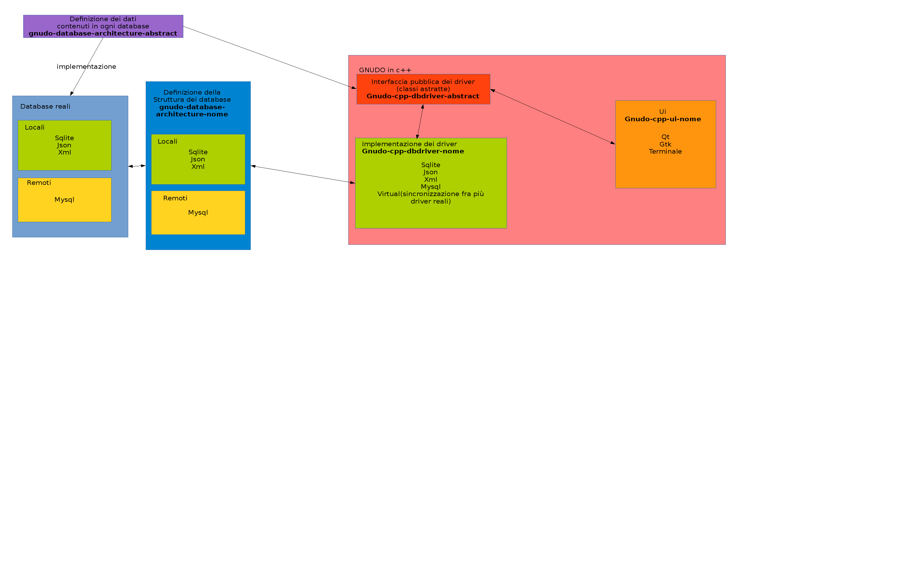

# Motivazioni dietro all'architettura di GNUDO

## Partiamo da un'architettura minimale

> db <---> ui

In questo semplice esempio, l'interfaccia va a prendere i dati direttamente dal
db.

## I driver del database

> db <---> db driver (libreria) <---> ui

Adesso l'interfaccia non lavora più sul database: chiede ad un componente intermedio 
di farlo al posto suo.

In questo modo sarà possibile utilizzare sia database locali che remoti, sia binari 
che in testo semplice, semplicemente cambiando il driver. Infatti la ui sa solo 
che il driver offre certe azioni, non si preoccupa di come le eseguirà.

I driver potranno essere anche utilizzati da altri programmi: questo ridurrà il 
numero di bug e semplificherà la scrittura di nuove interfacce.

Siccome è necessario che tutti i driver mostrino le stesse azioni all'interfaccia, 
ci sono un insieme di classi astratte da usare come base quando si scrivono nuovi 
driver.

## Definizione del contenuto dei database

Grazie ai driver, possono essere utilizzati più tipi di database. 

Nel caso si volesse progettare un nuovo database, bisognerebbe conoscere i dati 
da contenere. Di questo parla l'[architettura astratta del database](https://github.com/matteoalessiocarrara/GNUDO-database-architecture-abstract).

## Definizione dell'architettura di un database

È vero che un driver può essere utilizzato da più programmi, ma potrebbe essere 
necessario riscriverlo. Ipotizziamo di avere un driver in python: farlo girare 
su android sarebbe troppo complicato, quindi si decide di riscriverlo in java.

Ovviamente due driver equivalenti devono lavorare sul database __nello stesso modo__. 
È quindi necessaria una descrizione dell'architettura del database, ovvero dei 
dati contenuti e della loro organizzazione.
